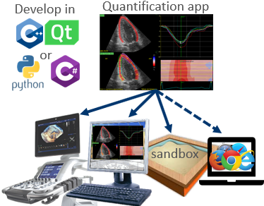

Welcome to the GE Healthcare Ultrasound developer program. Please see the [wiki](../../wiki) for a description of the program.

  
This repo hosts API definitions and sample code for ultrasound "apps" running directly on-device, as well as real-time network streaming of 2D/3D ultrasound data.

## Windows platform instructions

### Requirements
* Windows 10 or newer.
* [Visual Studio](https://visualstudio.microsoft.com/) 2017 or newer, either professional or community edition. The community edition can be downloaded through the "Visual Studio Dev Essentials" program.
  * The API is not tied to any version of Visual Studio, but the sample code is not guaranteed to build.
  * Enable C++ and NuGet support during installation.
* [CMake](https://cmake.org/) installed.
* [Python Tools for Visual Studio](https://visualstudio.microsoft.com/vs/features/python/) with the `comtypes`, `numpy` and `matplotlib` packages installed.
* Optional: Configure the %QT_ROOT_64% environment variable to point to a 64bit [Qt](https://www.qt.io/) 5.15 or newer SDK compatible with your Visual Studio version. See [Getting Started with Qt](https://doc.qt.io/qt-5/gettingstarted.html) if you're new to Qt.
* Optional: Install WiX Toolset and Visual Studio extension from https://wixtoolset.org/releases/ to be able to build the MSI installer projects (activated through CMake `ENABLE_INSTALLERS` option).

### Getting started
* Download the AppAPI NuGet package from [releases](../../releases), and store it in a NuGet package source. You can configure a local folder as package source from the Tools -> Options -> NuGet Package Manager -> Package Sources menu in Visual Studio.
* Download and install AppSandbox from [releases](../../releases).
* Run AppAPI.bat to generate a AppAPI.sln solution file.
* Open AppAPI.sln in Visual Studio. Visual Studio *must* run as "administrator" to be allowed to register the EXE/DLL components.
* Build solution.
* Open AppSandbox from the start menu. Within AppSandbox, open 2D/3D datasets, then open the desired app.

The Microsoft `guidgen.exe` tool can be used to generate unique GUIDs for apps. This tool is distributed with Visual Studio, and available from the `Tools` -> `Create GUID` menu option. The GUIDs need to be registered in order for the apps to show up in AppSandbox. This is typically done as a post-build step, or as part of running an installer.

## MacOS platform instructions

### Requirements
* [Qt](https://www.qt.io/) 5.15.x for MacOS.
* [CMake](https://cmake.org/) 3.19.2 or above.

### Getting started
* **Download library dependencies** 
  * Download the latest _AppAPI_MobileSandbox_ ZIP archive from [releases](../../releases). Extract this archive into `[REPO_ROOT]/packages` where `[REPO_ROOT]` is the root folder in this repository. After extraction, the folder structure should look like this:
    ```
    [REPO_ROOT]/packages/include/
    [REPO_ROOT]/packages/lib/
    [...]
    ```
* When building from command line, set `export QT_ROOT=~/Qt/5.15.1` where `~/Qt/5.15.1` should be updated to match the location and version of Qt on your machine.
* **Building for MacOS from command line**
  * To configure, run `cmake -DCMAKE_FIND_ROOT_PATH="$QT_ROOT/clang_64" -S . -B build`.
  * To build, run `cmake --build build --parallel`.
  * To run the QmlTestApp plugin, run `./build/apps/QmlTestApp/QmlTestAppStandalone.app/Contents/MacOS/QmlTestAppStandalone` and select an image data file to load.
    * You can also supply data files on the command line, e.g. `./QmlTestAppStandalone tissue.vscanset` or `2d.dcm`.
* **Building for MacOS from Qt Creator**
  * Open the root _CMakeLists.txt_ file in Qt Creator 4.15.x or above.
  * Select kit, e.g. _Desktop Qt 5.15.1 clang 64bit_, and press _Configure Project_.
  * Press the play button or type ⌘R to build and run.
* **Building for iOS from command line**
  * Set `export XCODE_ATTRIBUTE_DEVELOPMENT_TEAM="XXXXXXXXXX"`, where `XXXXXXXXXX` is a 10-character development Team ID. The Team ID can be found on the page [https://developer.apple.com/account/#!/membership](https://developer.apple.com/account/#!/membership) in the Apple Developer account.
    * Alternative: This step can be skipped if building with an Apple ID that is not currently subscribed to the Apple Developer Program. In this case, all _bundle identifiers_ used for deployment will need to be updated to something _globally unique_. Updating bundle identifiers can be done through XCode or by manually changing the `MACOSX_BUNDLE_GUI_IDENTIFIER` in relevant CMakeLists.txt projects. Furthermore, if building without a subscription to the Apple Developer Program, deployment can only target an iOS device signed into to the same Apple ID used for code signing.
  * Configure the project by running:
    ```
    cmake -G Xcode -DCMAKE_FIND_ROOT_PATH="$QT_ROOT/ios" -DCMAKE_CONFIGURATION_TYPES=Release -DCMAKE_TOOLCHAIN_FILE=$PWD/buildscripts/ios.toolchain.cmake -DPLATFORM=OS64 -DARCHS=arm64 -DENABLE_BITCODE=0 -DDEPLOYMENT_TARGET=12.0 -DENABLE_VISIBILITY=1 -DENABLE_ARC=0 -DCMAKE_XCODE_ATTRIBUTE_TARGETED_DEVICE_FAMILY=1,2 -DXCODE_ATTRIBUTE_CODE_SIGN_IDENTITY=\"iPhone Developer\" -DCMAKE_XCODE_ATTRIBUTE_DEVELOPMENT_TEAM=$XCODE_ATTRIBUTE_DEVELOPMENT_TEAM -S . -B build_iOS
    ```
    from the root folder of the repository.
  * To deploy the QmlTestApp plugin, open `[REPO_ROOT]/build_iOS/AppAPI.xcodeproj` in XCode and build and deploy the QmlTestAppStandalone target to an iOS device.
  * Transfer an appropriate data file to the iOS device, e.g. `CIRS057A-forward-volume-sweep.dcm` (see https://github.com/GEUltrasound/TestData/releases/tag/logiq-data-2020) or any `*.vscanset` file, and select this when prompted by QmlTestAppStandalone. 
* **Building for Android from command line**
  * Install Android studio from https://developer.android.com/studio
  * In Android Studio open "Preferences for New Projects" > "System Settings" > "Android SDK" > "SDK Tools" and select "NDK (Side by Side)" to install the NDK.
  * Set `export JAVA_HOME=/Applications/Android\ Studio.app/Contents/jre/Contents/Home` or other JDK installation.
  * Set `export ANDROID_SDK_ROOT=~/Library/Android/sdk` where `~/Library/Android/sdk` should be updated to match the Android SDK location on your machine.
  * Set `export ANDROID_NDK_ROOT=~/Library/Android/sdk/ndk/<version>` where `<version>` should be updated to match the Android NDK version on your machine.
  * Configure the project by running the following command
    ```
    cmake -DCMAKE_BUILD_TYPE=Debug -DCMAKE_FIND_ROOT_PATH=$QT_ROOT/android -DANDROID_PLATFORM=android-29 -DCMAKE_TOOLCHAIN_FILE=$ANDROID_NDK_ROOT/build/cmake/android.toolchain.cmake -DANDROID_ABI=arm64-v8a -S . -B build_Android
    ```
  * To build, run `cmake --build build_Android --parallel`.
  * To test your plugin, install the relevant APK on Android device connected to your computer by running e.g. `$ANDROID_SDK_ROOT/platform-tools/adb install build_Android/apps/QmlTestApp/QmlTestAppStandalone-arm64-v8a/build/outputs/apk/debug/QmlTestAppStandalone-arm64-v8a-debug.apk` or copying and installing the APK on the device manually.

## Sample code
The sample code is divided into two categories:
* [App samples](apps/)  - sample projects for "apps" that run on-device (C++/Qt & C#)
* [Host samples](host/) - standalone sample projects that accesses ultrasound data from file or through network streaming (C++, C# & Python)

## Documentation
API documentation is found on the [Interfaces](../../wiki/) wiki pages, as well as in the IDL-files within the [NuGet package](../../releases). There's also high-level documentation on the AppAPI [architecture](../../wiki/Architecture).

## Sample data

Sample image data for testing can be downloaded from https://github.com/GEUltrasound/TestData/releases
